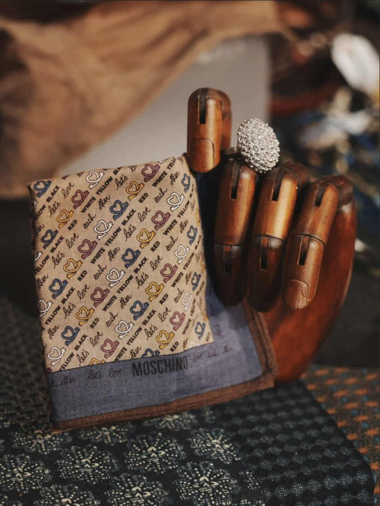

# the intelligent AI agent for fashion from Suanfamama 算法妈妈
## AI agent goal
* the core task is to CAPTURE the beauty and SHARE them with the beloved ones for fashion

## AI agent outcome showcase

## AI agent technical aspect
### unified framework for both hardware and software
* ROS and Genesis for simulation

### unified framework for internal and external
* Tools such as sequential models, neural network etc to simulate the perception, planning, reasoning and action space in env for fashion

### unified framework for agents with env
* Agents to communicate for collaboration and competition
* learning from the env

### unified framework for basic living and advanced beauty appreciation
* Beyond basic living, there is beauty.

### code
* The improved MIT license is applied and please SEND an email to mama.xiao@suanfamama.com for general inquiries

## project & product code
* transformer^3

## core team & contributors
* anying, Suanfamama, anying@suanfamama.com
* youling, Suanfamama, youling@suanfamama.com
* jinpei, Suanfamama, jinpei@suanfamama.com
* wei, Suanfamama, wei.huang@suanfamama.com
* wei, Suanfamama, wei@suanfamama.com
* mama, Suanfamama, mama.xiao@suanfamama.com

## referneces part1 - computer scientists
* Weimin Shen, https://viterbi-web.usc.edu/~wmshen/, for the contribution of adaptive, self-reconfigurable, autonomous robots and systems
* Kaiming He, https://people.csail.mit.edu/kaiming/, for the contribution of large vision models
* Kevin Knight, https://kevincrawfordknight.github.io/, for the contribution of language understanding
* Yuanlie He, for the contribution of scene understanding & reconstruction
* Yongquan Yu, for the contribution of weights adaptation
* Linus Torvalds, https://linustorvaldslinux.weebly.com/, for the contribution of os kernel capabilities
* Robot Operating System, https://www.ros.org/, for the contribution of low level arch
* Genesis, https://www.genesis-3d.com/, for the contribution of high level arch
* PyTorch, https://pytorch.org/, for the contribution of deep learning framework
* Suanfamama, https://www.suanfamama.com/, for the contribution of making the agent work
* Leonard Adleman, https://adleman.usc.edu/, for the contribution of encription and decryption
* Michael A. Arbib, https://viterbi.usc.edu/directory/faculty/Arbib/Michael, for the contribution of mapping capabilities to brain regions
* Ellis Horowitz, https://ellishorowitz.com/, for the contribution of application level internet arch
* Laurent Itti, http://ilab.usc.edu/itti/, for the contribution of agent planning
* David Kempe, https://www.david-kempe.com/, for the contribution of algorithms complexity analysis in time and space
* Yuhui Quan, https://csyhquan.github.io/, for the contribution of models for visual signal processing & understanding
* Torsten Suel, http://engineering.nyu.edu/~suel/, for the contribution of pruning tech
* Juan Rodriguez, https://engineering.nyu.edu/life-tandon/student-life/commencement/2021/profiles/juan-rodriguez, for the contribution of the agent's inverted index pruning
* Phyllis Frankl, https://scholar.google.com/citations?hl=en&user=XE683E8AAAAJ, for the contribution of the agent's robotness
* Keith Ross, https://sites.google.com/nyu.edu/keithross, for the contribution of agent's communication network design
* Edward Wong, https://engineering.nyu.edu/faculty/edward-wong, for the contribution of agent's hallucination in fashion
* Juliana Freire, https://vgc.engineering.nyu.edu/~juliana/, for the contribution of agents' data (mostly state and actions) storage & indexing & querying infra
* Claudio Silva, https://engineering.nyu.edu/faculty/claudio-silva, for the contribution of agents' data (mostly state and actions) viz & analysis & prediction infra
* Nasir Memon, https://engineering.nyu.edu/faculty/nasir-memon, for the contribution of agents' on & off networking infra
* Lisa Hellerstein, https://wp.nyu.edu/tandonschoolofengineering-lisahellerstein/, for the contribution of agents' vertical database & knowledge base in fashion
* Chunlin Duan, for the contribution of agents' theory development of fashion information flow
* Yann LeCun, https://yann.lecun.com/, for the contribution of 
* Jeff Dean, https://x.com/jeffdean, for the contribution of evaluation on service latency, system throughput and coding

## references part2 - hardware and software tools
* Zane Durante et al., Agent AI: Surveying the Horizons of Multimodal Interaction, https://arxiv.org/abs/2401.03568
* ROS, https://www.ros.org/
* Genesis, https://genesis-embodied-ai.github.io/

## references part3 - typical books
* Building a General Theory of Evolution by Leonard Adleman, 2024-12
* Artificial Intelligence: A Modern Approach by Stuart Russell and Peter Norvig, 2022-08

## extras & belief
* GDUT, https://english.gdut.edu.cn/, for the contribution of 
* USC trojans, https://www.usc.edu/we-are-trojans/, for the contribution of the motto to be a symbol of victory, triumph, and regeneration
* NYU traditions, https://www.nyu.edu/faculty/governance-policies-and-procedures/faculty-handbook/the-university/history-and-traditions-of-new-york-university/university-traditions.html, for the contribution of the motto to be Perstare et Praestare
* SCUT, https://www.scut.edu.cn/en/, for the contribution of
