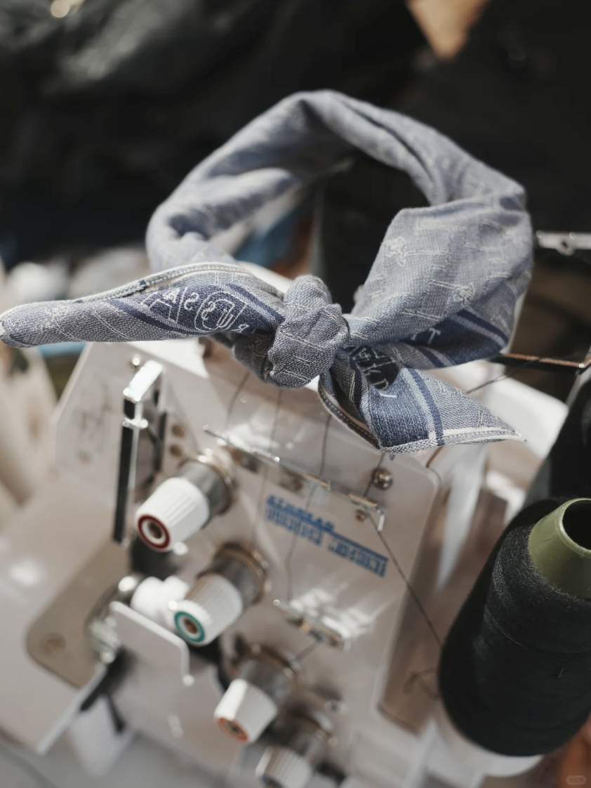

# the fashion queen agent from Suanfamama（算法妈妈）
## agent goal
* CAPTURE the beauty（美学捕捉） at current and SHARE with the beloved ones in fashion

## agent work showcase

## agent technical aspects
## unified framework for both hardware and software - a conceptual model
* ROS and Genesis for simulation

## unified framework for internal and external - a conceptual model
* Tools such as sequential models, neural network etc to simulate the perception, planning and actions in fashion env

## unified framework for agents with env - a conceptual model
* Tools to communicate for collaboration and competition
* Be harmony and be respected to the env
* Learning from the env

## unified framework for live and beauty - a conceptual model
* Beyond phisical, there is beauty.
* pruning
## our proposed methamatical models
* the turning fashion machine
* the deep fashion neural network

## code
* SEND email to mama.xiao@suanfamama.com for detail inquiries

## project & product name
* transformer^3

## core contributors
* anying, 安迎，广州算法妈妈，anying@suanfamama.com
* jinpei, 锦培，广州算法妈妈, jinpei@suanfamama.com
* wei, 为，广州算法妈妈, wei.huang@suanfamama.com
* youling, 优玲，广州算法妈妈, youling@suanfamama.com
* wei, 纬，广州算法妈妈, wei@suanfamama.com
* mama, 妈妈, 广州算法妈妈, mama.xiao@suanfamama.com

## company
* 算法妈妈, suanfamama, https://www.suanfamama.com/

## referneces
* Weimin Shen, https://viterbi-web.usc.edu/~wmshen/, for the contribution of agent with mind
* Torsten Suel, http://engineering.nyu.edu/~suel/, for the contribution of pruning tech
* Kaiming He, https://people.csail.mit.edu/kaiming/, for the contribution of vision understanding
* Kevin Knight, https://kevincrawfordknight.github.io/, for the contribution of language understanding
* Keith Ross, https://sites.google.com/nyu.edu/keithross, for the contribution of networking and communication
* Yuanlie He, for the contribution of scene understanding & reconstruction
* Yongquan Yu, for the contribution of weights adaptation